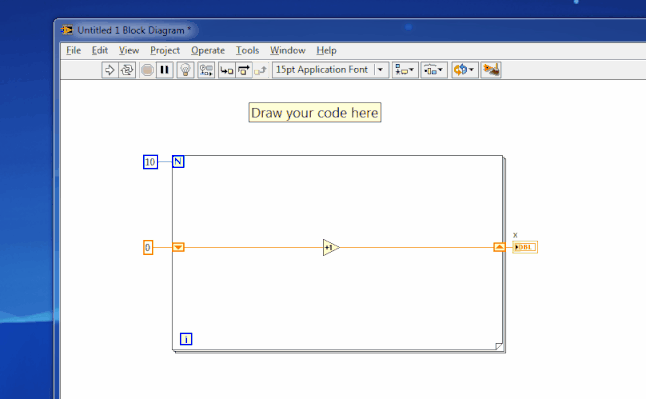
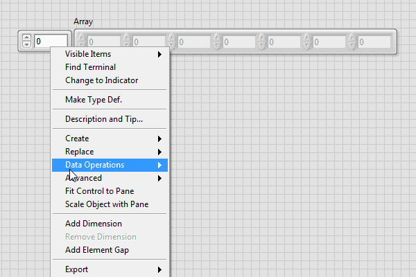
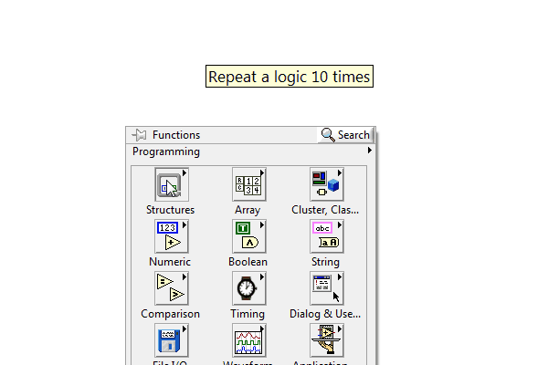
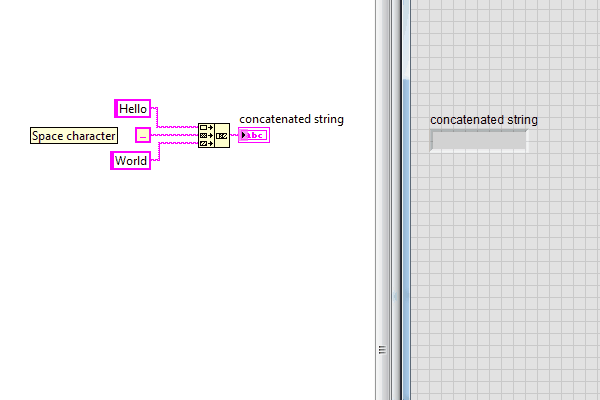
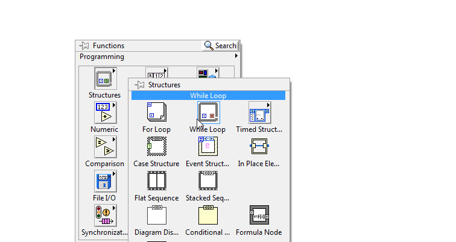
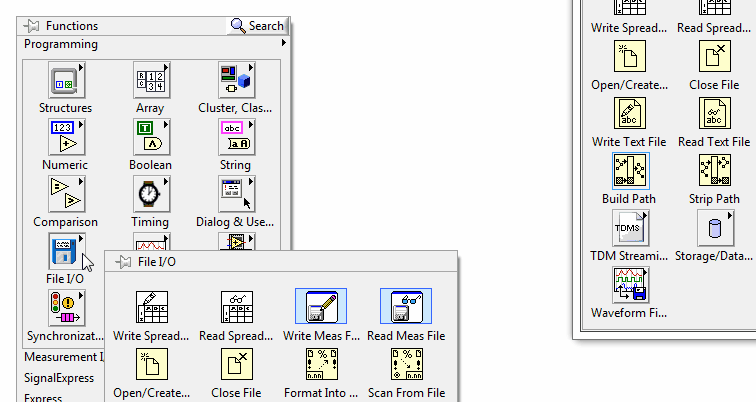
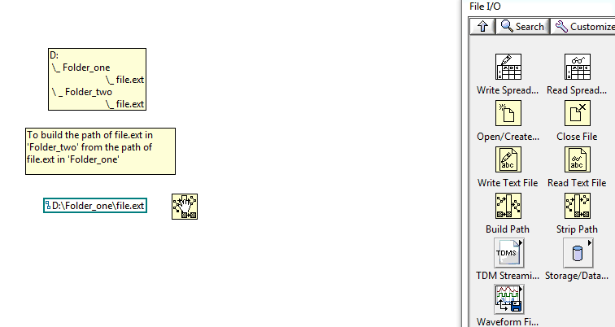
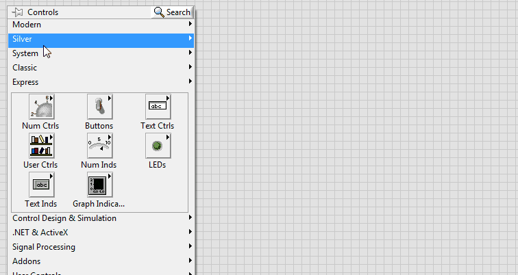
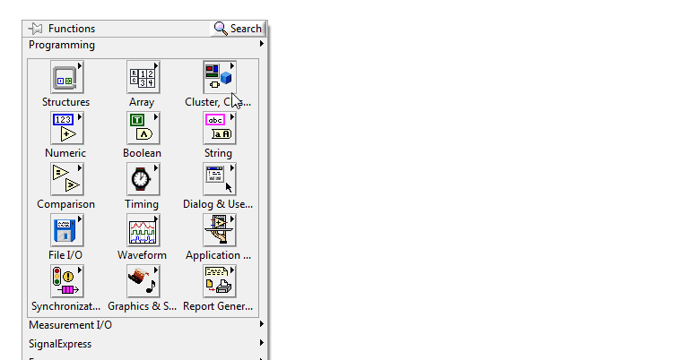

title: Labview Crash Course
author:
  name: Prashanth Gandhiraj
  twitter: neotheicebird
  url: https://github.com/neotheicebird
output: index.html
controls: true

--

# Labview 101
## First look at labview from A - Z

--
### Syllabus

List of topics we would be discussing in this course:

* [Day-1: Introduction to Labview](./course.html#3)
* [Day-2: Arrays and for loop](./course.html#13)
* [Day-3: Strings, enum, Boolean and Comparison](./course.html#23)
* [Day-4: While loop](./course.html#35)
* [Day-5: Files, and Event structure](./course.html#44)

--
### Syllabus

List of topics we would be discussing in this course:

* [Day-6: Test what we learnt so far and some programming philosophy](./course.html#53)
* [Day-7: Clusters](./course.html#64)
* [Day-8: Waveform, Math, and Express VIs](./course.html#68)
* [Day-9: State machines](./course.html#75)
* [Day-10: State machines](./course.html#76)
* [Day-11: DAQ and MAX](./course.html#81)

--
# Day - 01: Introduction to Labview
--

### What is labview?

Labview is a Graphical Programming language. You have to use the mouse a lot more than the keyboard. 

**Warning:** Possibility of physical damage. Exercise your fingers regularly because drawing programs is fun and we wont stop until our fingers cry for rest! :D
--

### Data flow model

Labview follows the data flow model. The program logic is a set of blocks with data flowing in between them. 
The data flows from blocks to blocks just like electricity flows in an electronic circuit.

--

### GUI is inevitable (almost always)

All programs we write would have a code (called diagram) and a GUI (graphical user interface)
The two places we frequently work with in labview are:
* Front panel
* Block diagram

--

### Front panel

In the front panel we add controls and indicators required by the program.
* Controls: Switches, knobs, sliders, text box, filepaths etc which lets user input data to the program
* Indicators: Text box, LEDs, Graphs, etc which displays data back to the user

--

### Front panel - 2

Example of a front panel:

--

### Block Diagram

Block diagram is the canvas in which we draw our code. We place different blocks called `SubVIs` and
connect these blocks using `wires`.

--

### Palettes

Standard SubVis are present in modules called `palettes`.
To view palettes, in **Block diagram >> Right-click** and different Palettes appear. Browse through it to find the block you need.

--

### Connecting wires

To connect wires, simply **left click** to snap on to an output node of a block and **left click again** on the input node of another block

If a wire is not connected properly, it appears as **dashed lines**. Use **Ctrl+Z** to undo or **Ctrl+B** to remove all **broken wires**
--

### Exercise -- 01

* Try placing some SubVIs on the block diagram and connect wires between them
* Given simple equations like `y = 3x - 5`, `y = 4x^2 + 7x + 6`, get `x` value from user and output `y`
*Hint: use Numeric palette*
* Dice roll: For every run of a program a random number from 1 to 6 should be shown as output.

--

# Day - 02: Arrays and for loop

--

### What are arrays?

Arrays are a collection of elements of the same datatype. Its like having a stack of money. The value of each note in the stack can vary, but they all belong to the same 'data-type' called money.

--
### Examples of arrays and their uses

Arrays can be formed with strings, numbers, booleans. There are also arrays of special datatypes, which will be discussed later.

## Examples
* An array of strings is used to handle book names in a library
* Pixels on your mobile screen has a 2-Dimensional array of numbers behind it
* An array of booleans can be used to create a LED blinker with the help of a DAQ

--
### Dimension of an array

* A stack of postcards to deliver to a single street in our city is an 1D array.
* for a city we can have many stacks placed next to each other, with each stack belonging to a corresponding street, would make a 2D array.
* Similarly we can scale to N-Dimension

--
### Creating an array in front panel

--
### Array palette

--
### Creating an array in block diagram

### Adding dimesion to an array

--
### For loop

A for loop is a rectangular structure, the logic in which is repeated N times

--
### working with array using for loop

**Auto-indexing**. If you wire an array to a For Loop, you can read and process every element in that array by
enabling auto-indexing

--
### Exercise - 2

* Take two 1D arrays `10,20,30,40,50` and `11,22,33,44,55`, add them element-wise and return an array
* Take 1D array of names of everyone present in class, let the user input a name. Search the array and find out if the name is present and notify user.
* given any 1D array do `sorting, split into two equal halfs, reverse each half, stitch them together` and return a 1D array
* create a 2D array of random numbers
--
# Day - 03: Strings, enum, comparison and Booleans

--
### Strings

A string is a set of characters. strings are useful in processing human readable data using labview.

The most common characters used in string are:
* `a-z` (lowercase alphabets), `A-Z` (uppercase alphabets), `0-9` (digits)
* `.,*&#$%^()!@"'{}[]/\~` (Special characters)
* `\n`, `\t`, `\r` (Escape codes)
--
### Concatenate strings

--
### String manipulation

Strings are manipulated mainly using the following set of SubVis

--
### String formatting

So your code generates some numbers, say your age, But you want to display it as a string to user. For this kind of problems we need the formatting SubVI.

--
### String-Number conversions

Another way to add age (number) to your string is by first converting it into a string. For this go to **string palette>>String/Number conversion**

--
### Shift register

If in loops we want to store values of previous iteration, we have to use **shift registers**

--
### Enum

An `Enum` is a selectable list which gives out an integer

--
### Booleans

--
### Uses of boolean

Booleans are used for Yes/No decisions. Is your age greater than 18? True/False.  1 > 0 = True. All True and False decisions fall under boolean.

Explore Boolean palette and find out how different blocks work.
--
### Comparison Palette

We can compare variables of different datatypes and make decisions in our code.

--
### Exercise - 3
* Let user input a 1D array of strings, concatenate the strings in a for loop with `\n` escape code inbetween
* A robot understands only `1's or 0's`. Convert any number from (0 to 255), convert them into a boolean array and display result with 8 LEDs.
* Given a string `s beautiful!World i`, using only one SubVi get the string `World is beautiful!`
* 1 - Roll a Dice 5 times and store it to an array
  2 - Let user input a lucky number
  3 - If the lucky number is present atleast 2 times in the array, declare the user to be `Winner` else `Loser`
--
# Day - 04: While loop
--
### While loop
While loop repeats execution of its contents unless some conditions are met. Make a condition (say check if iteration i>10) and wire it to condition terminal.

--
### Case structure
Used if you want to execute two different set of codes for different conditions. Like if it is raining outside, I will take an umbrella, If it is hot outside, I will use sunscreen, and If it is cold outside, I will use some cream.

--
### Delay in loops
Sometimes loops have to be run slowly than it can, so that the processor is not under heavy load. Using `wait` inside loops helps in using resources more aptly as the solution needs.

--
### Date and time
Timing palette has all that we need to bring time into the picture. If we want to add timestamps to our code, to show the user date and time.

--
### Exercise - 4 - part-1
* Make an enum with keys `hot, warm, cold`. Using a case structure and an infinite loop, display a custom message for each selection that the user makes anytime the program runs (dont forget to add a wait in the loop). 
For example, if user selects `hot`, you can tell the user `Welcome to chennai!`.
* Download [temperature.vi](./problems/temperature.vi), [temperatures.csv](./problems/temperatures.csv) and add code such that `Read one temperature value per second. if temperature > 50 say to user 'Too hot!' and stop program`
--
### Exercise - 4 - part-2
* Write a program that asks the user for a number `n` and gives him the possibility to choose between computing the `sum` and computing the `product` of `1,. . .,n`. And returns the value of `sum()` or `product()` obtained.
--
### Exercise - 4 - part-3
* Write a program that takes a array of strings and prints them, one per line, in a rectangular frame. For example the array `["Hello", "World", "in", "a", "frame"]` gets printed as(Use `while-loop`):

    *********
    * Hello *
    * World *
    * in    *
    * a     *
    * frame *
    *********
--
### Exercise - 4 - part-4
* Make a digital clock that displays time in format `HH-MM-SS AM/PM`.
* Find out and implement a sorting algorithm for any given array of integers (without using sort array from array palette).
--
# Day - 05: Files, and Event structure
--
### File Palette

Using file palette we can read and write files.

A text file example:

--
### Types of files

Some common file types that we use mostly are:
* Text files
* Binary files
--
### Manipulating file path

File path is the address to reach a file, to read or write or append or delete or any operations on it.

--
### file constants

File constants can be used to get default directories, the VIs path, VIs directory.

--
### Event structure

An event structure is used to capture events like user mouse click or value change in front-panel and more...

--
### Exercise - 5 - part-1
* Using LV, Create a textfile in you name (name.txt) and write in it `Hello world!`
* Read the [sample.txt](./problems/sample.txt) provided using LV and display the contents
--
### Exercise - 5 - part-2
* Place an event structure in an infinite while loop and place atleast 3 different controls (numeric, buttons, sliders etc).
  On `value change` of any of the controls, the latest of which was changed, its name should be displayed on a string indicator `last_changed`
--
### Exercise - 5 - part-3
* Let user give a file directory path, filename and text input in a continuously running VI. Once a button `write this` is clicked, a new file of the name
given should be created in the destination given, with the contents typed by the user.

--
# Day - 06: Test what we learnt and some philosophy!
--
### 15 Questions, 45 minutes
Access this form and submit your answers. 

[test-01](https://docs.google.com/forms/d/1YQxDD_IVMAaq2yPeJQrI5E5ekSxnY4RwtjZO7RdfJuM/viewform?usp=send_form)
--
### Programming philosophy - 01

To create any software for a defined problem, this is one of the methods to work on it (The Software Method):

1. Define the problem (scenario).
2. Design an algorithm and/or flowchart.
3. Implement the design.
4. Test and verify the implementation.
5. Maintain and update the implementation.
--
### Scenario
During the scenario stage of the software development method, you define
what your problem is so that you can approach it with all the necessary
factors identified. You can remove extraneous factors during this phase and
focus on the core problem that you must solve. How you identify the
problem initially can save you time while you design and implement a
solution
--
### Design
* Identify the Inputs
* Identify the Outputs
* Identify Additional Requirements - like units of inputs.
* Algorithm or flowchart or state diagram to solve the problem
--
### Implementation
In the implementation stage, you create code for your algorithm or
flowchart. Because LabVIEW is a graphical programming
language, the flowchart works much the same way.
--
### Testing
Testing and verifying is an important part of the software development
method. Make sure to test your implementation with data that is both logical
and illogical for the solution you created. Testing logical data verifies that
the inputs produce the expected result. By testing illogical data, you can test
to see if the code has effective error handling
--
### Maintenance

Maintenance is the ongoing process of resolving programming errors and
adding parallel construction changes to the original solution for a problem. 
--
### Exercises - 6 - part-1
* Go to [gliffy](http://www.gliffy.com) or choose any other diagram editor. Create a flow chart for the following problem.

This VI takes an input array that contains a mixture of positive and negative values and separates that array into two smaller arrays: one that contains the negative values and one that contains the positive values.
The Initialize Array function and Build Array function are used and the For Loop sets its count by auto-indexing the input array.
--
### Exercises - 6 - part-2
* Implement the previous problem
* Implementing Basic Set Theory: The Intersection and/or Union of Two Sets.
Process two sets of data and return the intersection and/or the union of the two sets. The sets are represented by one-dimensional arrays.
--
### References

* Questions in Test-01 are taken from [CLAD Q&A from NI](http://www.ni.com/gate/gb/GB_EKITCLADEXMPRP/US). 
--
# Day - 07: Clusters
--
### Cluster
When we want to group a set of variables/controls/indicators of different datatypes, we use a cluster.

--
### Cluster indicator, controls and constant

A cluster can be set as a control, indicator or a constant.

--
### Cluster palette

Cluster palette contains VIs that can be used to manipulate clusters.

--
# Day - 08: Waveform, Math, and Express VIs
--
### Waveform graph
A waveform graph is used to display waveforms:

--
### Math palette
Math palette is used to generate math functions like sine, cosine, or in cases of fitting data like using least-squares best fit.
There are many other use cases for this palette.

--
### Generate sine signal

--
### Express VIs
Express VIs make life easier. They are useful when we need to implement things fast and easy, and customization is not very important.

--
### Exercise - 8 - Part 01

- Generate a sine(x) and a cosine(x) signal for the same `x`. prove by plotting the equation `sin(x)^2 + cos(x)^2 = 1`
- Write a guessing game where the user has to guess a secret number. After every guess the program tells the user whether his number was too large or too small. 
At the end the number of tries needed should be printed. I counts only as one try if the user inputs the same number consecutively.
--
### Exercise - 8 - Part 02
- Write a function that computes the list of the first 100 Fibonacci numbers.
- create a SubVi which computes `x^2 + tan(x) + 3`. Plot it continuously using waveform graph, for x being time in seconds from start of the program.
--
# Day 9: State machines
--
# Day 10: State machines: ..continued
--
### Use of event structure in poll

Event structure saves effort and is more reactive than handling buttons by any other logic

--
### Other routing options: Enum arrays

Instead of placing a enum and routing in every case, we can move most of the routing logic to the poll case. 
Try using a array of enum and some array functions.

--
### Other routing options: array of strings

--
### Exercise: 10

Create a state diagram and implement a stop watch timer.
--
# Day 11: DAQ and MAX
--
### DAQ

Data AcQusition card is used to measure electrical signals. NI's DAQ comes in various sizes and form factors, with varying capabilities.
Primarily used to capture signals, they are easy to configure and use.
--
### MAX

The Measurement and Automation eXplorer is a software that comes along with DAQ. It is used to maintain various devices connected or not-connected. We can create devices that simulate real devices and generate simple signal, this is useful to test our code, incase we dont have a device setup realtime.
--
### Exercise: 11

- Create a simulation device (any device of your choice), sample the lines at 100Hz, store to a labview database (tdms file). Hint: use DAQ Assistant.
- Without using DAQ assistant try to generate a continuous sine signal using Analog output.
--
### TO Work on
* waveform graph, Create EXE
* DAQ and MAX
* A glimpse of advanced topics: Property nodes, invoke nodes, 
