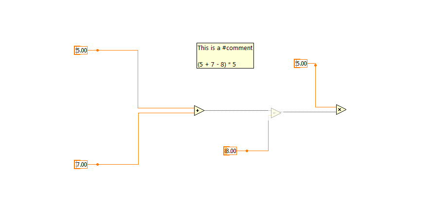

title: Labview Crash Course
author:
  name: Prashanth Gandhiraj
  twitter: neotheicebird
  url: https://github.com/neotheicebird
output: course.html
controls: true

--

# Labview 101
## First look at labview from A - Z

--

### Syllabus

List of topics we would be discussing in this course:

* [Day-1: Basic introduction to Labview](./course.html#3)

--

### What is labview?

Labview is a Graphical Programming language. You have to use the mouse a lot more than the keyboard. 

**Warning:** Possibility of physical damage. Exercise your fingers regularly because drawing programs is fun and we wont stop until our fingers cry for rest! :D
--

### Data flow model

Labview follows the data flow model. The program logic is a set of blocks with data flowing in between them. 
The data flows from blocks to blocks just like electricity flows in an electronic circuit.

--

### GUI is inevitable (almost always)

All programs we write would have a code (called diagram) and a GUI (graphical user interface)
The two places we frequently work with in labview are:
* Front panel
* Block diagram

--

### Front panel

In the front panel we add controls and indicators required by the program.
* Controls: Switches, knobs, sliders, text box, filepaths etc which lets user input data to the program
* Indicators: Text box, LEDs, Graphs, etc which displays data back to the user

--

### Front panel - 2

Example of a front panel:

--

### Block Diagram

Block diagram is the canvas in which we draw our code. We place different blocks called `SubVIs` and
connect these blocks using `wires`.

--

### Palettes

Standard SubVis are present in modules called `palettes`.
To view palettes, in **Block diagram >> Right-click** and different Palettes appear. Browse through it to find the block you need.

--

### Connecting wires

To connect wires, simply **left click** to snap on to an output node of a block and **left click again** on the input node of another block

If a wire is not connected properly, it appears as **dashed lines**. Use **Ctrl+Z** to undo or **Ctrl+B** to remove all **broken wires**
--

### Exercise

* Try placing some SubVIs on the block diagram and connect wires between them
* Given simple equations like `y = 3x - 5`, `y = 4x^2 + 7x + 6`, get `x` value from user and output `y`
*Hint: use Numeric palette*
* Dice roll: For every run of a program a random number from 1 to 6 should be shown as output.