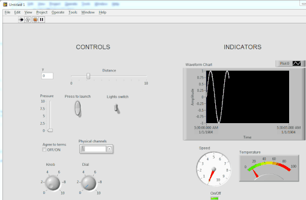
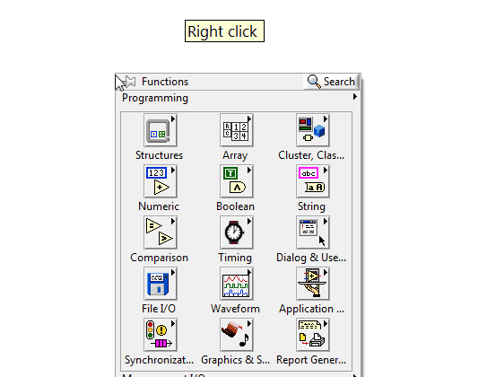
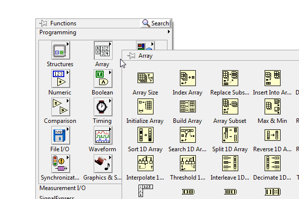
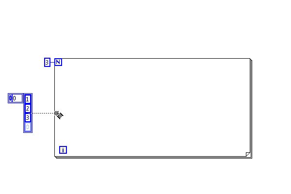
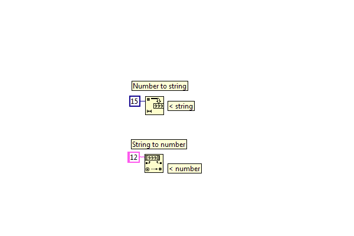
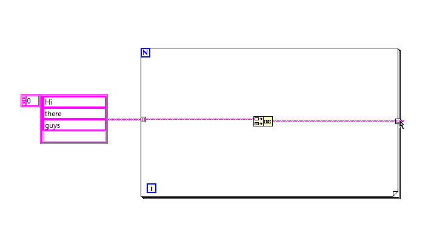
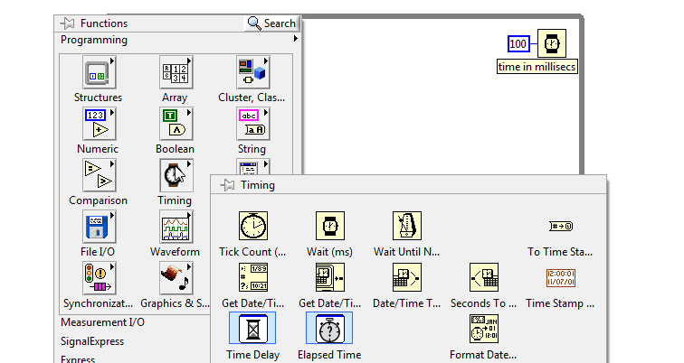

title: Labview Crash Course
author:
  name: Prashanth Gandhiraj
  twitter: neotheicebird
  url: https://github.com/neotheicebird
output: index.html
controls: true

--

# Labview 101
## First look at labview from A - Z

--

### Syllabus

List of topics we would be discussing in this course:

* [Day-1: Introduction to Labview](./course.html#3)
* [Day-2: Arrays and for loop](./course.html#13)
* [Day-3: Strings, enum, Boolean and Comparison](./course.html#13)

--

# Day - 01: Introduction to Labview

--

### What is labview?

Labview is a Graphical Programming language. You have to use the mouse a lot more than the keyboard. 

**Warning:** Possibility of physical damage. Exercise your fingers regularly because drawing programs is fun and we wont stop until our fingers cry for rest! :D
--

### Data flow model

Labview follows the data flow model. The program logic is a set of blocks with data flowing in between them. 
The data flows from blocks to blocks just like electricity flows in an electronic circuit.

--

### GUI is inevitable (almost always)

All programs we write would have a code (called diagram) and a GUI (graphical user interface)
The two places we frequently work with in labview are:
* Front panel
* Block diagram

--

### Front panel

In the front panel we add controls and indicators required by the program.
* Controls: Switches, knobs, sliders, text box, filepaths etc which lets user input data to the program
* Indicators: Text box, LEDs, Graphs, etc which displays data back to the user

--

### Front panel - 2

Example of a front panel:

--

### Block Diagram

Block diagram is the canvas in which we draw our code. We place different blocks called `SubVIs` and
connect these blocks using `wires`.

--

### Palettes

Standard SubVis are present in modules called `palettes`.
To view palettes, in **Block diagram >> Right-click** and different Palettes appear. Browse through it to find the block you need.

--

### Connecting wires

To connect wires, simply **left click** to snap on to an output node of a block and **left click again** on the input node of another block

If a wire is not connected properly, it appears as **dashed lines**. Use **Ctrl+Z** to undo or **Ctrl+B** to remove all **broken wires**
--

### Exercise -- 01

* Try placing some SubVIs on the block diagram and connect wires between them
* Given simple equations like `y = 3x - 5`, `y = 4x^2 + 7x + 6`, get `x` value from user and output `y`
*Hint: use Numeric palette*
* Dice roll: For every run of a program a random number from 1 to 6 should be shown as output.

--

# Day - 02: Arrays and for loop

--

### What are arrays?

Arrays are a collection of elements of the same datatype. Its like having a stack of money. The value of each note in the stack can vary, but they all belong to the same 'data-type' called money.

--
### Examples of arrays and their uses

Arrays can be formed with strings, numbers, booleans. There are also arrays of special datatypes, which will be discussed later.

## Examples
* An array of strings is used to handle book names in a library
* Pixels on your mobile screen has a 2-Dimensional array of numbers behind it
* An array of booleans can be used to create a LED blinker with the help of a DAQ

--
### Dimension of an array

* A stack of postcards to deliver to a single street in our city is an 1D array.
* for a city we can have many stacks placed next to each other, with each stack belonging to a corresponding street, would make a 2D array.
* Similarly we can scale to N-Dimension

--
### Creating an array in front panel

--
### Array palette

--
### Creating an array in block diagram

### Adding dimesion to an array

--
### For loop

A for loop is a rectangular structure, the logic in which is repeated N times

--
### working with array using for loop

**Auto-indexing**. If you wire an array to a For Loop, you can read and process every element in that array by
enabling auto-indexing

--
### Exercise - 2

* Take two 1D arrays `10,20,30,40,50` and `11,22,33,44,55`, add them element-wise and return an array
* Take 1D array of names of everyone present in class, let the user input a name. Search the array and find out if the name is present and notify user.
* given any 1D array do `sorting, split into two equal halfs, reverse each half, stitch them together` and return a 1D array
* create a 2D array of random numbers
--
# Day - 03: Strings, enum, comparison and Booleans

--
### Strings

A string is a set of characters. strings are useful in processing human readable data using labview.

The most common characters used in string are:
* `a-z` (lowercase alphabets), `A-Z` (uppercase alphabets), `0-9` (digits)
* `.,*&#$%^()!@"'{}[]/\~` (Special characters)
* `\n`, `\t`, `\r` (Escape codes)
--
### Concatenate strings

--
### String manipulation

Strings are manipulated mainly using the following set of SubVis

--
### String formatting

So your code generates some numbers, say your age, But you want to display it as a string to user. For this kind of problems we need the formatting SubVI.

--
### String-Number conversions

Another way to add age (number) to your string is by first converting it into a string. For this go to **string palette>>String/Number conversion**

--
### Shift register

If in loops we want to store values of previous iteration, we have to use **shift registers**

--
### Enum

An `Enum` is a selectable list which gives out an integer

--
### Booleans

--
### Uses of boolean

Booleans are used for Yes/No decisions. Is your age greater than 18? True/False.  1 > 0 = True. All True and False decisions fall under boolean.

Explore Boolean palette and find out how different blocks work.
--
### Comparison Palette

We can compare variables of different datatypes and make decisions in our code.

--
### Exercise - 3
* Let user input a 1D array of strings, concatenate the strings in a for loop with `\n` escape code inbetween
* A robot understands only `1's or 0's`. Convert any number from (0 to 255), convert them into a boolean array and display result with 8 LEDs.
* Given a string `s beautiful!World i`, using only one SubVi get the string `World is beautiful!`
* 1 - Roll a Dice 5 times and store it to an array
  2 - Let user input a lucky number
  3 - If the lucky number is present atleast 2 times in the array, declare the user to be `Winner` else `Loser`
--
# Day - 04: While loop
--
### While loop
While loop repeats execution of its contents unless some conditions are met. Make a condition (say check if iteration i>10) and wire it to condition terminal.

--
### Case structure
Used if you want to execute two different set of codes for different conditions. Like if it is raining outside, I will take an umbrella, If it is hot outside, I will use sunscreen, and If it is cold outside, I will use some cream.

--
### Delay in loops
Sometimes loops have to be run slowly than it can, so that the processor is not under heavy load. Using `wait` inside loops helps in using resources more aptly as the solution needs.

--
### Date and time
Timing palette has all that we need to bring time into the picture. If we want to add timestamps to our code, to show the user date and time.

--
### Exercise - 4 - part-1
* Make an enum with keys `hot, warm, cold`. Using a case structure and an infinite loop, display a custom message for each selection that the user makes anytime the program runs (dont forget to add a wait in the loop). 
For example, if user selects `hot`, you can tell the user `Welcome to chennai!`.
* Download [temperature.vi](./problems/temperature.vi), [temperatures.csv](./problems/temperatures.csv) and add code such that `Read one temperature value per second. if temperature > 50 say to user 'Too hot!' and stop program`
--
### Exercise - 4 - part-2
* Write a program that asks the user for a number `n` and gives him the possibility to choose between computing the `sum` and computing the `product` of `1,. . .,n`.
* Write a program that takes a array of strings and prints them, one per line, in a rectangular frame. For example the array `["Hello", "World", "in", "a", "frame"]` gets printed as. Use `while-loop`:

*********
* Hello *
* World *
* in    *
* a     *
* frame *
*********
--
### Exercise - 4 - part-3
* Make a digital clock that displays time in format `HH-MM-SS AM/PM`.
* Find out and implement a sorting algorithm for any given array of integers (without using sort array from array palette).
--
### TO Work on
* other Loops and Timing (shift register,)
* File i/o, waveform graph, Create EXE, Error Handling (create a signal file and display it using waveform graph)
* Event structure, enums, state machine (basics)
* Clusters,  state machine (intermediate)
* DAQ and MAX